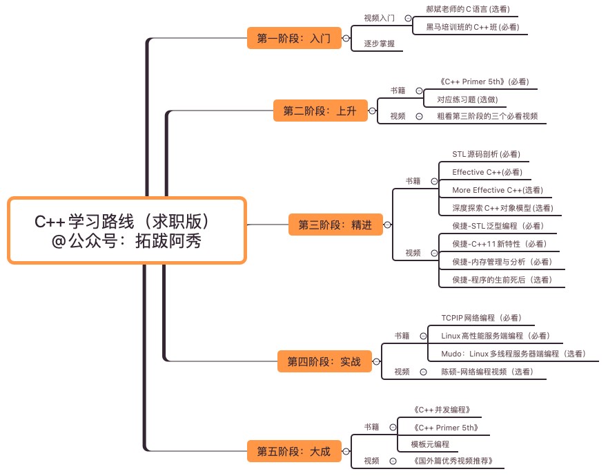

# 概述

## 基础语法学习计划

## 刷题的计划

[GitHub - youngyangyang04/leetcode-master: 《代码随想录》LeetCode 刷题攻略：200道经典题目刷题顺序，共60w字的详细图解，视频难点剖析，50余张思维导图，支持C++，Java，Python，Go，JavaScript等多语言版本，从此算法学习不再迷茫！🔥🔥 来看看，你会发现相见恨晚！🚀](https://github.com/youngyangyang04/leetcode-master)

# 基础语法

# 刷题

### 1  数组
